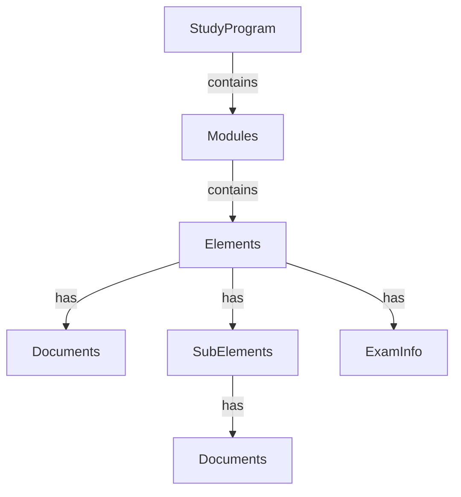

# Data Structure Documentation

## Overview
The WBH Campus Scraper extracts study program data from HTML exports and produces a structured JSON file. This document describes the complete data structure.

## JSON Structure

```json
{
  "study_program": { ... },
  "modules": { ... },
  "elements": [ ... ]
}
```

## Root Level Objects

### 1. study_program
Contains metadata about the study program.

| Field | Type | Description | Example |
|-------|------|-------------|---------|
| `id` | integer | Unique program identifier | 46566 |
| `number` | string | Program number | "1110" |
| `name` | string | Program name | "Informatik (Bachelor)" |

### 2. modules
Dictionary of modules, keyed by module ID.

```json
"modules": {
  "786": {
    "id": 786,
    "name": "Mathematische Grundlagen für Informatiker",
    "code": null,
    "credit_points": 8.0,
    "element_ids": [48, 1048, 1050, 4552],
    "exam_ids": [4552],
    "study_material_ids": [48, 1048, 1050]
  }
}
```

#### Module Fields

| Field | Type | Description |
|-------|------|-------------|
| `id` | integer | Unique module identifier |
| `name` | string | Module name in German |
| `code` | string/null | Module code if available |
| `credit_points` | float/null | Credit points (extracted from exams) |
| `element_ids` | array[int] | All element IDs in this module |
| `exam_ids` | array[int] | IDs of exam elements |
| `study_material_ids` | array[int] | IDs of study material elements |

### 3. elements
Array of all study elements (courses, exams, seminars).

```json
{
  "id": 783,
  "code": "B-INF01XX",
  "name": "Einführungsprojekt für Informatiker",
  "type": "exam",
  "study_month": 1,
  "semester": 1,
  "module_id": 1056,
  "credit_points": 2.0,
  "is_passed": false,
  "exam_info": { ... },
  "documents": [ ... ],
  "sub_elements": [ ... ]
}
```

#### Element Fields

| Field | Type | Description | Required |
|-------|------|-------------|----------|
| `id` | integer | Unique element identifier | Yes |
| `code` | string | Element code (e.g., "B-INF01XX") | Yes |
| `name` | string | Element name in German | Yes |
| `type` | string | Element type: "exam", "learning_module", "seminar" | Yes |
| `study_month` | integer | Study month (1-based) | No (default: 0) |
| `semester` | integer | Semester number (0 for additional) | No (default: 0) |
| `module_id` | integer/null | Parent module ID | No |
| `credit_points` | float/null | Credit points (only for exams) | No |
| `is_passed` | boolean | Whether the element is passed | No (default: false) |
| `exam_info` | object/null | Exam-specific information | No |
| `documents` | array | Attached documents | No (default: []) |
| `sub_elements` | array | Sub-elements | No (default: []) |

## Nested Objects

### exam_info
Additional information for exam elements.

```json
"exam_info": {
  "exam_form": "Einsendeaufgabe",
  "prerequisites": "Teilnahmevoraussetzungen siehe aktuelles Prüfungshandbuch",
  "allowed_aids": "siehe aktuelles Prüfungshandbuch",
  "core_topics": null
}
```

| Field | Type | Description |
|-------|------|-------------|
| `exam_form` | string/null | Type of exam |
| `prerequisites` | string/null | Prerequisites for participation |
| `allowed_aids` | string/null | Allowed aids during exam |
| `core_topics` | string/null | Core topics covered |

### documents
Array of attached documents with download information.

```json
{
  "filename": "B-GOPB01XX_SS1.pdf",
  "content_type": "pdf",
  "size": "585.73 KB",
  "url": "/moodle/webservice/pluginfile.php/7805/mod_folder/content/0/B-GOPB01XX_SS1.pdf",
  "description": null
}
```

| Field | Type | Description |
|-------|------|-------------|
| `filename` | string | File name |
| `content_type` | string | File type: "pdf", "epub", "html", "mp3", "zip", "unknown" |
| `size` | string/null | File size as string |
| `url` | string | Download URL (relative path) |
| `description` | string/null | Optional description |

### sub_elements
Nested elements within a parent element.

```json
{
  "id": 50,
  "code": "B-GOPB01XX",
  "name": "Repetitorium: Grundlagen der objektorientierten Programmierung mit Java",
  "type": "repetitorium",
  "documents": []
}
```

| Field | Type | Description |
|-------|------|-------------|
| `id` | integer | Sub-element identifier |
| `code` | string | Sub-element code |
| `name` | string | Sub-element name |
| `type` | string | Sub-element type |
| `documents` | array | Attached documents |

## Element Types

### Main Types
- **exam**: Prüfung (examination) - contains credit points
- **learning_module**: Lernheft (study booklet) - study materials
- **seminar**: Seminar - interactive sessions

### Sub-Element Types
- **repetitorium**: Review/repetition course
- **online_test**: Online test
- **other**: Other types

## Data Relationships



## Semester Mapping

Study months are automatically mapped to semesters:
- Months 1-6 → Semester 1
- Months 7-12 → Semester 2
- Months 13-18 → Semester 3
- Months 19-24 → Semester 4
- Months 25-30 → Semester 5
- Months 31-36 → Semester 6
- Months 37+ → Semester 7+
- Month 0 → Semester 0 (additional elements)

## Statistics

The complete extraction typically includes:
- **1 Study Program**
- **25-30 Modules**
- **130-150 Elements** total
  - 25-30 Exams
  - 90-100 Learning Modules
  - 5-10 Seminars
- **200+ Documents**
- **140-180 Credit Points** total

## Validation Rules

1. **Credit Points**: Only extracted from exam elements
2. **Module Assignment**: Elements reference their parent module via `module_id`
3. **Document URLs**: Relative paths that need base URL prepending for download
4. **Semester Calculation**: Automatic based on study_month
5. **Type Classification**: Determined by element attributes and name patterns

## Usage Example

```python
import json

# Load the data
with open('data.json', 'r', encoding='utf-8') as f:
    data = json.load(f)

# Access study program info
program = data['study_program']
print(f"{program['number']} - {program['name']}")

# Iterate through modules
for module_id, module in data['modules'].items():
    print(f"Module {module['name']}: {module['credit_points']} CP")

# Filter elements by semester
semester_1 = [e for e in data['elements'] if e['semester'] == 1]
print(f"Semester 1 has {len(semester_1)} elements")

# Find all exams
exams = [e for e in data['elements'] if e['type'] == 'exam']
total_cp = sum(e.get('credit_points', 0) for e in exams)
print(f"Total credit points from exams: {total_cp}")
```